# MechaCar_Statistical_Analysis

  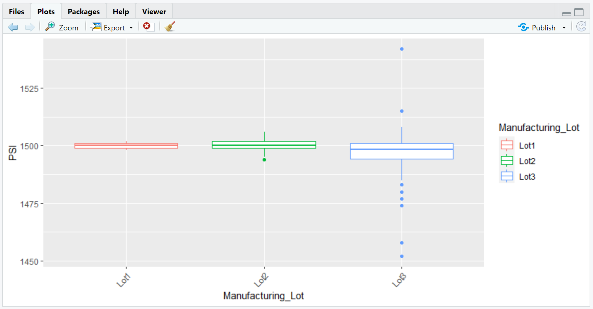

## Table of Contents
* [Overview](https://github.com/rkaysen63/MechaCar_Statistical_Analysis/blob/master/README.md#overview)
* [Resources](https://github.com/rkaysen63/MechaCar_Statistical_Analysis/blob/master/README.md#resources)
* [Linear Regression to Predict MPG](https://github.com/rkaysen63/MechaCar_Statistical_Analysis/blob/master/README.md#Linear-Regression-to-Predict-MPG)
* [Summary Statistics on Suspension Coils](https://github.com/rkaysen63/MechaCar_Statistical_Analysis/blob/master/README.md#Summary-Statistics-on-Suspension-Coils)
* [T-Tests on Suspension Coils](https://github.com/rkaysen63/MechaCar_Statistical_Analysis/blob/master/README.md#T-Tests-on-Suspension-Coils)
* [Study Design:  MechaCar vs Competition](https://github.com/rkaysen63/MechaCar_Statistical_Analysis/blob/master/README.md#Study-Design---MechaCar-vs-Competition)
* [Summary](https://github.com/rkaysen63/MechaCar_Statistical_Analysis/blob/master/README.md#summary)

## Overview:
Analysis of the production data of the MechaCar prototype is two-fold:
1. To identify which variables predict the mpg of the MechaCar prototypes, and
2. To determine if suspension coils of the manufacturing lots are statistically different from the mean population.

## Resources 
    
* Data: MechaCar_mpg.csv, Suspension_Coil.csv
* Tools: 
  * Programming Language: R
  * RStudio
  * R Libraries: jsonlite, tidyverse including dplyr, ggplot2
* Lesson Plan: UTA-VIRT-DATA-PT-02-2021-U-B-TTH, Module 15 Challenge

## Linear Regression to Predict MPG

  <a href="#">DataFrame:  MechaCar_MPG</a>
    
  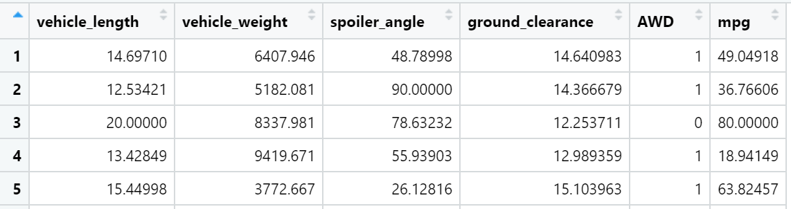

  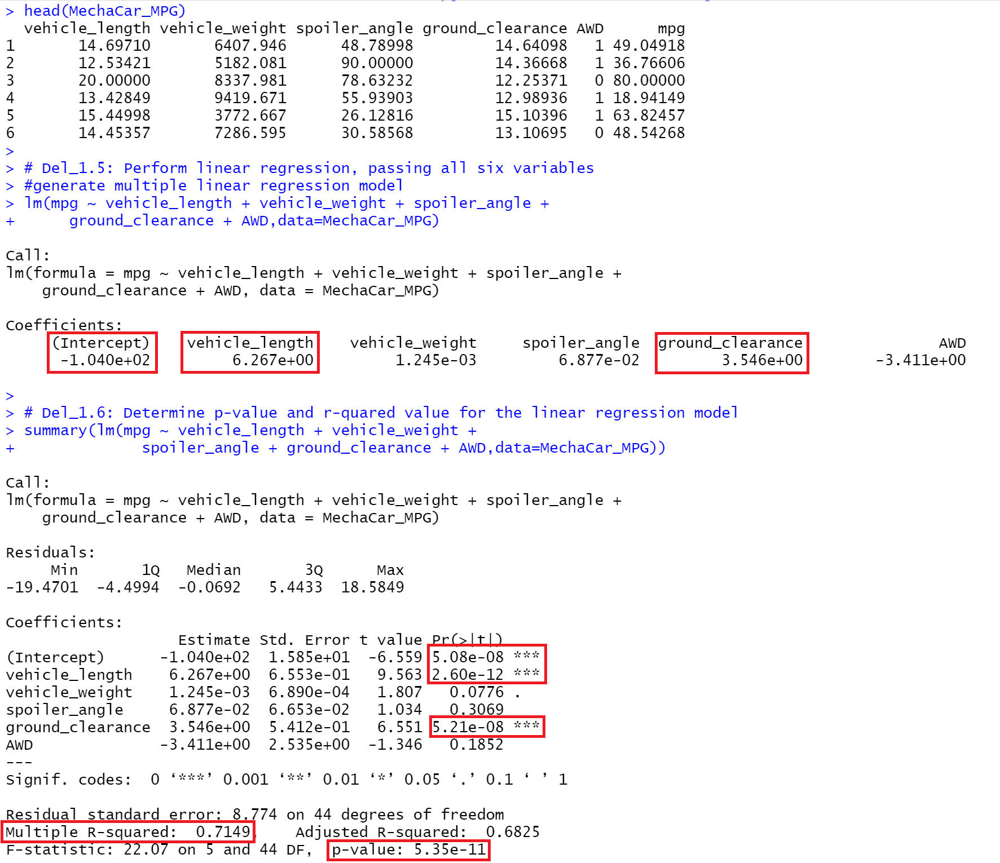

* In the summary output, the value of PR(>|t|) represents the probability that the coefficient contributes a random amount of variance to the linear model.  By comparing the each PR(>|t|) value to a significance level of 0.05%, the intercept (PR(>|t|) = 5.08e-08) and independent variables of vehicle-length (PR(>|t|) = 2.60e-12) and ground-clearance(PR(>|t|) = 5.21e-08), provide a non-random amount of variance to the linear model.  In other words, vehicle_length and ground_clearance do impact mpg.

* The multiple linear regression model created for the MechaCar_MPG data set is:  

     `y = 6.267x1 + 0.001245x2 + 0.06877x3 + 3.546x4 - 3.411x5 -104.0`
     
  It is evident by looking at the model, the slope for independent variables x1 (vehicle_length), x4 (ground_clearance), and x5 (AWD) are not zero, although there is no confidence that AWD is not random. The slopes of the independent variables, vehicle_length and ground_clearance, are positive indicating an improvement in mpg as vehicle_length increases and ground_clearance increases.
  
* The summary statistics indicates that the linear regression model predicts mpg of MechaCar prototypes effectively. The r-squared value = 0.7149.  The square root of r-squared = 0.8455.  There is a 'strong' correlation when r is greater than or equal to 0.7.  In addition, the p-value = 5.35e-11, which is far below the significance level of 5%.  The model shows which independent variables impact mpg and those variables that do not correlate at all. 
  Since it was determined that vehicle-length and ground-clearance do impact mpg, their data was graphed for visualization and their summary statistics are provided as well.  The graphs of vehicle-length and ground-clearance vs mpg indicates that mpg improves as these variables increase.  Their summary statistics have been provided as well. 
  The r-value for the vehicle_length model = 0.3715^-2 = 0.61.  The strength of the correlation is moderate.  The p-value for the vehicle-length model = 2.6e-06 which is far below significance level. 
  The r-value for the ground-clearance model = 0.1081^-2 = 0.33 indicates a correlation, albeit weak.  The p-value for the ground-clearance model = 0.01975 which is below the significance level for random variance of 5%.  

  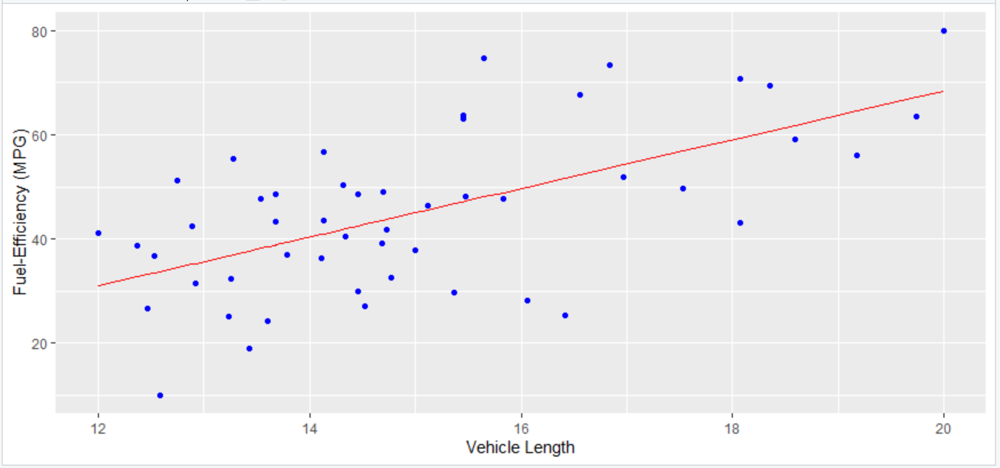 
   
  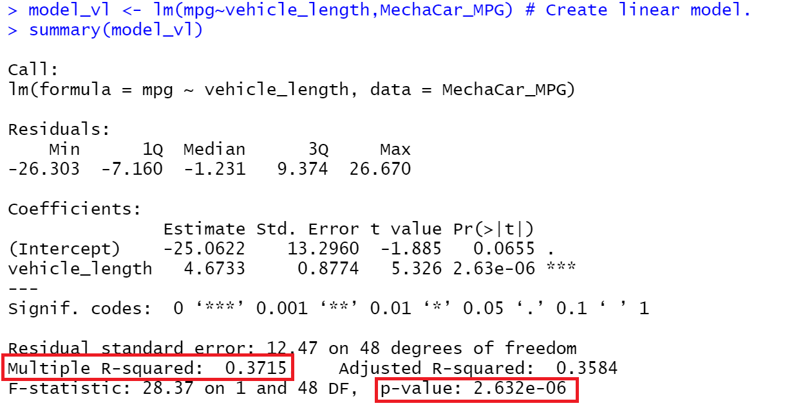 

  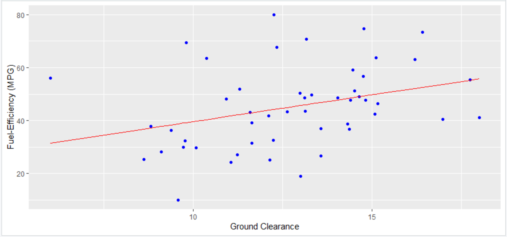 
   
  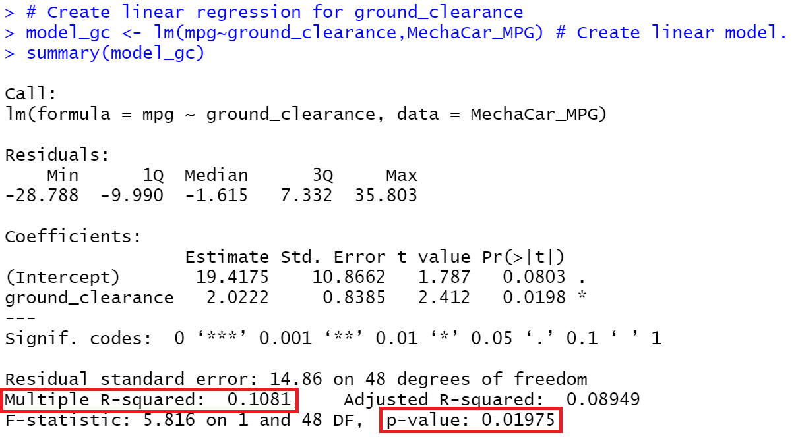 

## Summary Statistics on Suspension Coils

  <a href="#">DataFrame:  Suspension_Coil</a>
    
  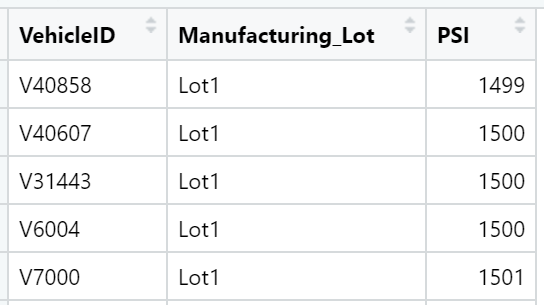

  <a href="#">Suspension Coil Data: PSI Statistics - All Manufacturing Lots</a>
      
  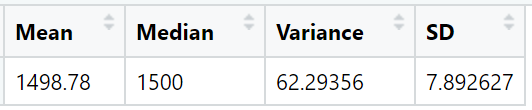

  <a href="#">Suspension Coil Data: PSI Statistics by Lot</a>
        
  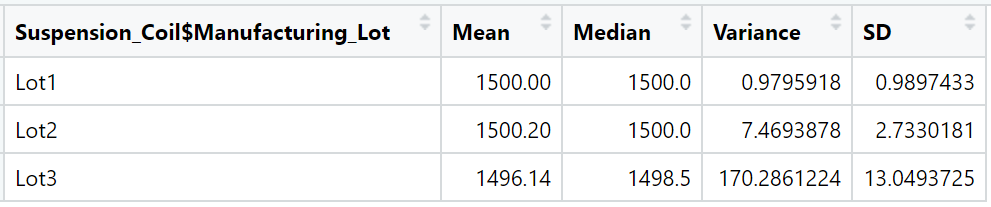

  <a href="#">Suspension Coil Data: Visualization of PSI Statistics by Lot</a>
      
  

* MechaCar's manufacturing variance across all lots is 62 pounds per square inch (psi) and well below its design specification that dictates that the variance of the suspension coils must not exceed 100 psi. The variance for Lot1 (0.98 psi) and Lot2 (7.5 psi) are very small and well below the design specification.  However, the variance of Lot3 data (170 psi) exceeds the 100 psi limit and does not meet the design specification.  The box plot shows a number of outliers for Lot3.

## T-Tests on Suspension Coils

  <a href="#">Suspension Coil Data: Population Density</a>
     
  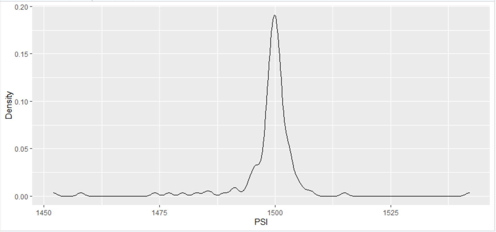

  

  <a href="#">Suspension Coil Data: Sample Population Density across all Lots</a>
     
  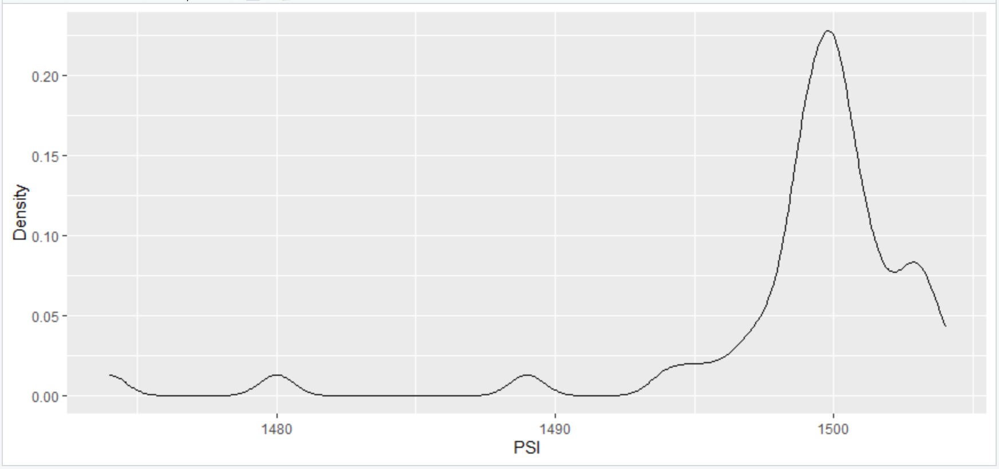

  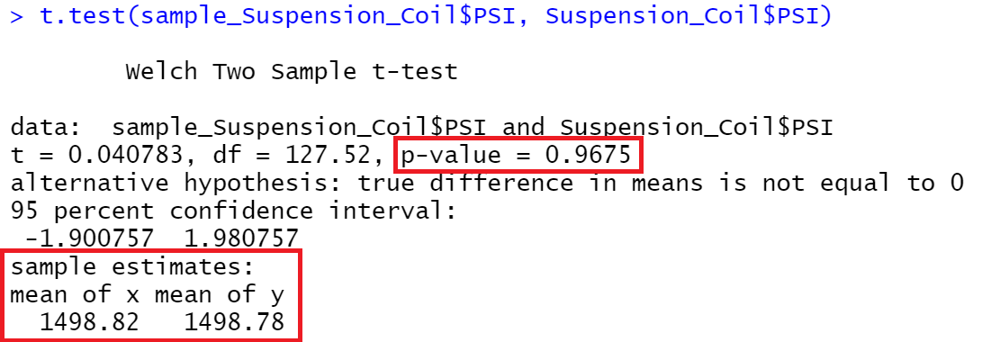

* Comparison of the density graphs of the population and the sample population show that there is no statistical difference between the sample means.  A t-test further supports the null hypothesis, "H0: There is no statistical difference between the two observed sample means."  Since the p-value = 0.9675 > 0.05 (5% significance level), we fail to reject the null.  The mean (sample) = 1498.82 is nearly the same as mean (population) = 1498.78.
  

  <a href="#">Suspension Coil Data: Lot1 Population Density</a>
     
  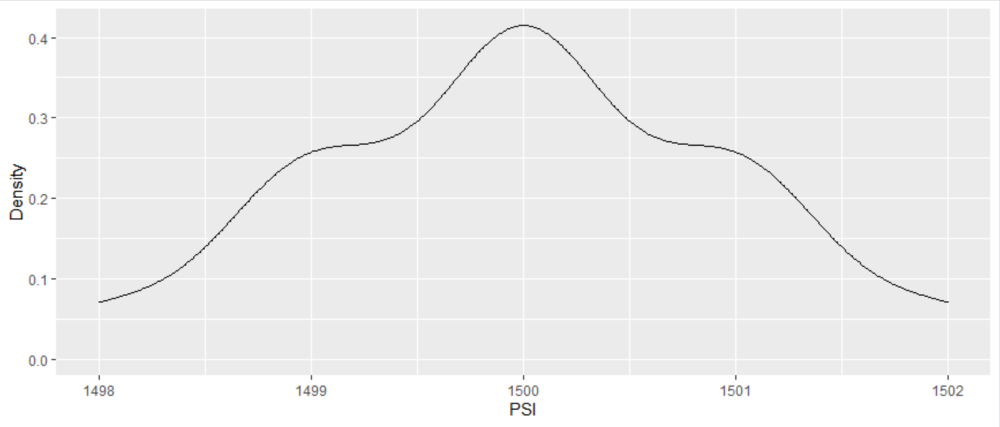

  

  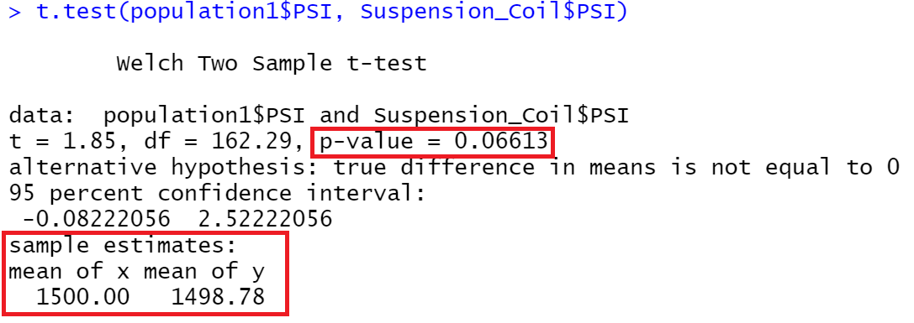

Comparison of the density graphs of the population and Lot1 population show that there is no statistical difference between the sample means.  A t-test further supports the null hypothesis, "H0: There is no statistical difference between the two observed sample means."  Since the p-value = 0.06613 > 0.05 (5% significance level), we fail to reject the null.  The mean (Lot1) = 1500.00 is nearly the same as mean (population) = 1498.78.
 

  <a href="#">Suspension Coil Data: Lot2 Population Density</a>
     
  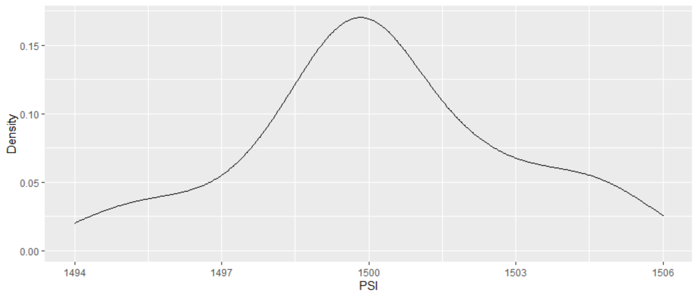

  

  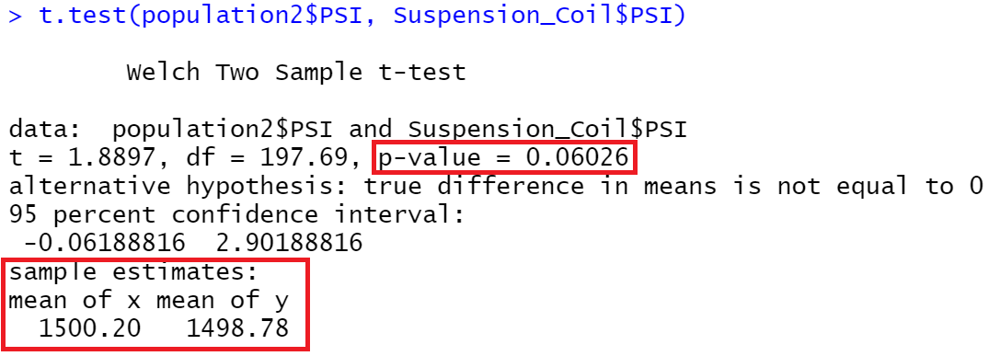

Comparison of the density graphs of the population and Lot2 population show that there is no statistical difference between the sample means.  A t-test further supports the null hypothesis, "H0: There is no statistical difference between the two observed sample means."  Since the p-value = 0.06026 > 0.05 (5% significance level), we fail to reject the null.  The mean (Lot2) = 1500.20 is nearly the same as mean (population) = 1498.78.  
  

  <a href="#">Suspension Coil Data: Lot3 Population Density</a>
     
  

  

  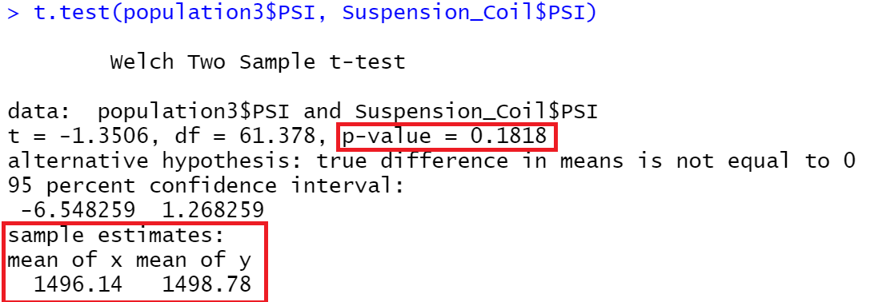

     

Comparison of the density graphs of the population and Lot3 population show that there is no statistical difference between the sample means.  A t-test further supports the null hypothesis, "H0: There is no statistical difference between the two observed sample means."  Since the p-value = 0.1818 > 0.05 (5% significance level), we fail to reject the null.  The mean (Lot3) = 1496.14 is nearly the same as mean (population) = 1498.78.  
  

## Study Design - MechaCar vs Competition

     

Before the final product version of MechaCar’s prototype is released to consumers, a statistical study comparing MechaCar to Competition could be performed in order to predict its success.

### Metrics: Consumers will be interested in MechaCar’s performance, cost and safety.
* Cost:  Mecha Car’s Average Cost/HP vs Competition’s Average Cost/HP
* Highway Fuel Efficiency:  Mecha Car’s MPG/weight vs Competition’s MPG/weight
* Safety: MechaCar’s Insurance Institute for Highway Safety’s (IIHS) are “A”, Acceptable, “G”, Good, “compared to Competion’s IIHS ratings

### Hypothesis Statements:
* Cost 
  H0:  MechaCar’s average cost per horsepower is less than Competition’s average cost per horsepower.  
  Ha:  MechaCar’s average cost per horsepower is not less than Competition’s average cost per horsepower.  

* Highway Fuel Efficiency
  H0:  MechaCar’s average mile per gallon (highway) by weight is greater than Competition’s average mile per gallon by weight.
  Ha:  MechaCar’s average mile per gallon (highway) by weight is not greater than Competition’s average mile per gallon (highway) by weight.

* Safety – The IIHS has a number of criteria that are tested to determine top safety pick.
  HO:  MechaCar’s IIHS ratings are greater than Competition’s IIHS ratings.
  Ha:  MechaCar’s IIHS ratings are not greater than Competition’s IIHS ratings.

### Statistical Testing:
* Cost:  A comparison of linear regression models, where y= cost, x = hp, for MechaCar and Competion will determine which has better cost per horsepower.  The slope should increase.  In other words, the general trend is that cost increases as hp increases.  If the slope of MechaCar’s increases more slowly than Competition, that is if the slope of MechaCar is less than the slope of Competition, than it will have a lower cost per horsepower.  
* Fuel efficiency:  A comparison of linear regression models, where y= miles per gallon (mpg), x = weight, for MechaCar and Competion will determine which has better fuel efficiency.  The slope should decrease for both models since it has been shown that fuel efficiency generally decreases as weight increases.  If the slope of MechaCar’s model decreases more slowly, i.e. is less than the slope of Competition’s model and the R-squared (>.25) and p-values (0.005) for MechaCar’s model give us confidence in the slope, we can “Fail to Reject Null” and with confidence claim that MechaCar is more fuel efficient than Competition.
* Safety:  Since the IIHS safety ratings are qualitative the comparison between them may be determined using the chi-squared test that enables quantification of the distribution of categorical variables.  The chi-square test would compare categorical distributions from a contingency table that include the IIHS ratings for MechaCar’s prototype in one column versus Competion’s in the other.  The rows of the contingency table would be the various rating categories. 
Or as simpler test could assign the ratings a numerical value, G (Good)=3, A(Acceptable)=2, M (Marginal)=1, P(Poor)=0, Superior=3, Advanced=2, Basic=1.  The table would include a column for MechaCar’s prototype and another for Competition.  The rows would be each of the test criteria with the rating for each filling the data cells.  The sum of the points would indicate which car has the greater safety rating. 

### Data Required:
* Cost data should include vehicle cost and horsepower for comparable models between the prototype and Competition.
* Fuel efficiency test data should include vehicle weight and highway miles per gallon.
* Safety test data should include IIHS safety ratings for cars of similar class.

## Summary:
1. The analysis shows that the independent variables that predict mpg of MechaCar prototypes are vehicle length and ground clearance.
2. The suspension coil mean for each manufacturing lot is statistically the same mean population.

[Back to the Table of Contents](https://github.com/rkaysen63/MechaCar_Statistical_Analysis/blob/master/README.md#table-of-contents)
