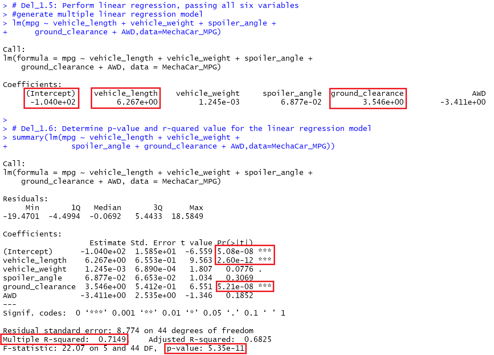

# MechaCar_Statistical_Analysis

  

## Table of Contents
* [Overview](https://github.com/rkaysen63/MechaCar_Statistical_Analysis/blob/master/README.md#overview)
* [Resources](https://github.com/rkaysen63/MechaCar_Statistical_Analysis/blob/master/README.md#resources)
* [Results](https://github.com/rkaysen63/MechaCar_Statistical_Analysis/blob/master/README.md#results)
* [Summary](https://github.com/rkaysen63/MechaCar_Statistical_Analysis/blob/master/README.md#summary)

## Overview:
Analysis of the production data of the MechaCar prototype is two-fold:
1. To identify which variables predict the mpg of the MechaCar prototypes, and
2. Determine if suspension coils of the manufacturing lots are statistically different from the mean population.

## Resources 
    
* Data: MechaCar_mpg.csv, Suspension_Coil.csv
* Tools: 
  * Programming Language: R
  * RStudio
  * R Libraries: jsonlite, tidyverse including dplyr, ggplot2
* Lesson Plan: UTA-VIRT-DATA-PT-02-2021-U-B-TTH, Module 15 Challenge

## Results:

## Linear Regression to Predict MPG

  

* Which variables/coefficients provided a non-random amount of variance to the mpg values in the dataset?
* Is the slope of the linear model considered to be zero? Why or why not?
* Does this linear model predict mpg of MechaCar prototypes effectively? Why or why not?

   
   
   

   
   
   

## Summary Statistics on Suspension Coils

The MechaCar Suspension_Coil.csv dataset contains the results from multiple production lots. In this dataset, the weight capacities of multiple suspension coils were tested to determine if the manufacturing process is consistent across production lots. Using your knowledge of R, you’ll create a summary statistics table to show:

* The suspension coil’s PSI continuous variable across all manufacturing lots

  

* The following PSI metrics for each lot: mean, median, variance, and standard deviation.

  

  

* The design specifications for the MechaCar suspension coils dictate that the variance of the suspension coils must not exceed 100 pounds per square inch. Does the current manufacturing data meet this design specification for all manufacturing lots in total and each lot individually? Why or why not?

## T-Tests on Suspension Coils
* t-test that compares all manufacturing lots against mean PSI of the population (5 pt)
* three t-tests that compare each manufacturing lot against mean PSI of the population (10 pt)
* There is a summary of the t-test results across all manufacturing lots and for each lot (5 pt)

  

  

  

  

  

  

  

  
  

  

  

  

  

  

  

## Summary:
    

[Back to the Table of Contents](https://github.com/rkaysen63/MechaCar_Statistical_Analysis/blob/master/README.md#table-of-contents)
